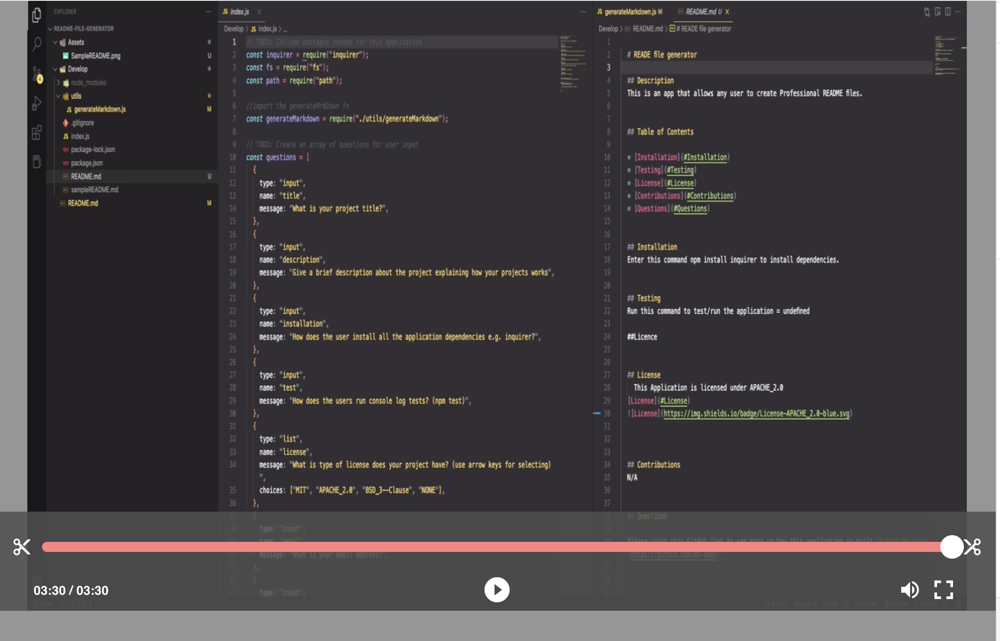

# ReadMe file Generator

## Description

This app generates readme Files to any user world wide.

## Table of Contents

- [Installation](#Installation)
- [Testing](#Testing)
- [License](#License)
- [Questions](#Questions)

## Installation

Enter this command npm inquirer to install dependencies.

## Testing

Run this command to test/run the application = undefined

## License

    This Application is licensed under MIT

[License](#License)

### ScreenCastify Video Demo ↓

## Questions

Please visit this GitHub link to see more on how this application is built [GitHub/mo-aden](https://github.com/mo-aden)

For additional information, please reach out to me in this email address mohamedaden17@outlook.com.
